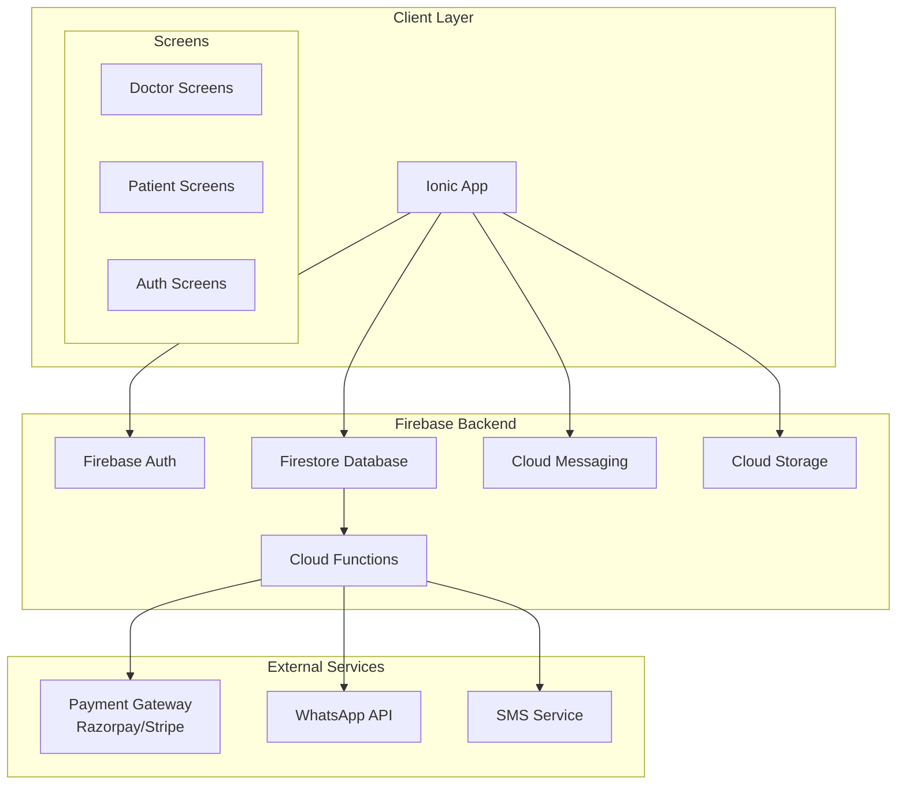

# Design Document

## Overview

The Doctor-Patient Consultation Booking Application is a cross-platform mobile healthcare solution built with Ionic and Firebase. The system follows a client-server architecture where the Ionic app serves as the frontend client, and Firebase provides backend services including authentication, database, cloud functions, storage, and messaging.

The application supports two primary user roles (doctors and patients) with role-based access control, real-time data synchronization, secure payment processing, and automated notification systems.

## Architecture

### High-Level Architecture



### Technology Stack

- **Frontend**: Ionic
- **Backend**: Firebase (Firestore, Auth, Functions, Storage, Messaging)
- **State Management**: Redux Toolkit with RTK Query
- **Navigation**: React Navigation 6
- **UI Components**: Ionic Elements  with custom green & white theme
- **Design Theme**: Primary green (#4CAF50), secondary white (#FFFFFF), accent light green (#E8F5E8)
- **Payment**: Razorpay/Stripe Ionic SDK
- **Notifications**: Firebase Cloud Messaging + Ionic Push Notifications
- **File Handling**: Ionic Document Picker, PDF generation libraries

## Components and Interfaces

### Core Components

#### 1. Authentication Module
```typescript
interface AuthService {
  signUpWithOTP(userType: 'doctor' | 'patient', phone: string): Promise<string> // returns verification ID
  verifyOTP(verificationId: string, otp: string, userData: UserRegistration): Promise<User>
  signUpWithPassword(userType: 'doctor' | 'patient', userData: UserRegistration): Promise<User>
  signUpWithGoogle(userType: 'doctor' | 'patient'): Promise<User>
  signInWithOTP(phone: string): Promise<string> // returns verification ID
  signInWithPassword(email: string, password: string): Promise<User>
  signInWithGoogle(): Promise<User>
  signOut(): Promise<void>
  getCurrentUser(): User | null
  resetPassword(email: string): Promise<void>
  sendOTP(phone: string): Promise<string>
  verifyOTPLogin(verificationId: string, otp: string): Promise<User>
  checkDuplicateContact(phone: string, email?: string): Promise<boolean>
  lockUserRole(userId: string, role: 'doctor' | 'patient'): Promise<void>
  preventRoleChange(userId: string): Promise<boolean>
}

interface UserRegistration {
  email?: string
  password?: string
  name: string
  phone: string
  userType: 'doctor' | 'patient' | 'admin'
  authMethod: 'otp' | 'password' | 'google'
  additionalData?: DoctorProfile | PatientProfile
  kycDocuments?: KYCDocuments // for doctors only
}

interface User {
  id: string
  email?: string
  phone: string
  name: string
  userType: 'doctor' | 'patient' | 'admin'
  authMethod: 'otp' | 'password' | 'google'
  isVerified: boolean
  isRoleLocked: boolean
  verificationStatus: 'pending' | 'approved' | 'rejected' | 'under_review'
  createdAt: Date
}
```

#### 2. Doctor Management Module
```typescript
interface DoctorService {
  createProfile(profile: DoctorProfile): Promise<void>
  updateProfile(doctorId: string, updates: Partial<DoctorProfile>): Promise<void>
  getProfile(doctorId: string): Promise<DoctorProfile>
  getBookings(doctorId: string, filters?: BookingFilters): Promise<Booking[]>
  approveBooking(bookingId: string): Promise<void>
  rejectBooking(bookingId: string, reason?: string): Promise<void>
  markPaymentReceived(bookingId: string): Promise<void>
}

interface DoctorProfile {
  id: string
  name: string
  email: string
  phone: string
  specialization: string
  clinicName: string
  consultationMode: 'online' | 'offline' | 'both'
  workingHours: WorkingHours[]
  consultationDuration: number // in minutes, default 15
  firstTimeConsultationFee: number
  repeatConsultationFee: number
  experience: number
  rating: number
  isVerified: boolean
  createdAt: Date
  updatedAt: Date
}

interface WorkingHours {
  dayOfWeek: number // 0-6 (Sunday-Saturday)
  startTime: string // "09:00"
  endTime: string // "17:00"
  isActive: boolean
}

interface TimeSlot {
  startTime: Date
  endTime: Date
  isAvailable: boolean
  bookingId?: string
}
```

#### 3. Patient Management Module
```typescript
interface PatientService {
  createProfile(profile: PatientProfile): Promise<void>
  updateProfile(patientId: string, updates: Partial<PatientProfile>): Promise<void>
  getProfile(patientId: string): Promise<PatientProfile>
  searchDoctors(filters: DoctorSearchFilters): Promise<DoctorProfile[]>
  getBookingHistory(patientId: string): Promise<Booking[]>
}

interface PatientProfile {
  id: string
  name: string
  email: string
  phone: string
  dateOfBirth?: Date
  gender?: 'male' | 'female' | 'other'
  address?: string
  emergencyContact?: string
  createdAt: Date
  updatedAt: Date
}
```

#### 4. Time Slot Management Module
```typescript
interface TimeSlotService {
  generateTimeSlots(doctorId: string, date: Date): Promise<TimeSlot[]>
  getAvailableSlots(doctorId: string, date: Date): Promise<TimeSlot[]>
  bookTimeSlot(doctorId: string, timeSlot: TimeSlot, bookingId: string): Promise<void>
  releaseTimeSlot(doctorId: string, timeSlot: TimeSlot): Promise<void>
  updateConsultationDuration(doctorId: string, duration: number): Promise<void>
}

interface TimeSlotGenerator {
  generateSlotsForDay(workingHours: WorkingHours, consultationDuration: number, date: Date): TimeSlot[]
  checkSlotAvailability(doctorId: string, timeSlot: TimeSlot): Promise<boolean>
}
```

#### 5. Booking Management Module
```typescript
interface BookingService {
  createBooking(booking: BookingRequest): Promise<Booking>
  getBooking(bookingId: string): Promise<Booking>
  updateBookingStatus(bookingId: string, status: BookingStatus): Promise<void>
  getAvailableSlots(doctorId: string, date: Date): Promise<TimeSlot[]>
  cancelBooking(bookingId: string, reason?: string): Promise<void>
}

interface Booking {
  id: string
  doctorId: string
  patientId: string
  consultationType: 'first-time' | 'repeat'
  consultationMode: 'online' | 'offline'
  scheduledDate: Date
  timeSlot: TimeSlot
  fee: number
  paymentMethod: 'online' | 'cash'
  paymentStatus: 'pending' | 'paid' | 'refunded'
  status: BookingStatus
  notes?: string
  prescriptionId?: string
  followUpDate?: Date
  createdAt: Date
  updatedAt: Date
}

type BookingStatus = 'pending' | 'approved' | 'rejected' | 'completed' | 'cancelled'
```

#### 6. Payment Processing Module
```typescript
interface PaymentService {
  processOnlinePayment(bookingId: string, amount: number): Promise<PaymentResult>
  verifyPayment(paymentId: string): Promise<boolean>
  processRefund(paymentId: string, amount?: number): Promise<RefundResult>
  getPaymentHistory(userId: string): Promise<Payment[]>
}

interface PaymentResult {
  success: boolean
  paymentId?: string
  error?: string
  transactionId?: string
}
```

#### 7. Prescription Management Module
```typescript
interface PrescriptionService {
  createPrescription(prescription: PrescriptionData): Promise<Prescription>
  sendPrescription(prescriptionId: string, method: 'whatsapp' | 'pdf'): Promise<void>
  getPrescription(prescriptionId: string): Promise<Prescription>
  generatePDF(prescriptionId: string): Promise<string>
}

interface Prescription {
  id: string
  bookingId: string
  doctorId: string
  patientId: string
  content: string
  attachments?: string[]
  sentVia?: 'whatsapp' | 'pdf' | 'both'
  createdAt: Date
}
```

#### 8. Analytics and Reporting Module
```typescript
interface AnalyticsService {
  getDoctorRevenue(doctorId: string, period: DateRange): Promise<RevenueReport>
  getPatientStatistics(doctorId: string, period: DateRange): Promise<PatientStats>
  exportReport(doctorId: string, reportType: ReportType, format: 'csv' | 'pdf'): Promise<string>
}

interface RevenueReport {
  totalRevenue: number
  firstTimeConsultations: {
    count: number
    revenue: number
  }
  repeatConsultations: {
    count: number
    revenue: number
  }
  monthlyBreakdown: MonthlyData[]
}
```

#### 9. Super Admin Panel Module
```typescript
interface AdminService {
  // Dashboard and Overview
  getDashboardStats(): Promise<AdminDashboardStats>
  getPlatformAnalytics(period: DateRange): Promise<PlatformAnalytics>
  
  // Doctor Management
  getAllDoctors(filters?: AdminFilters): Promise<DoctorProfile[]>
  approveDoctorRegistration(doctorId: string): Promise<void>
  rejectDoctorRegistration(doctorId: string, reason: string): Promise<void>
  editDoctorProfile(doctorId: string, updates: Partial<DoctorProfile>): Promise<void>
  deactivateDoctorProfile(doctorId: string, reason: string): Promise<void>
  manageFeaturedDoctor(doctorId: string, action: 'promote' | 'demote'): Promise<void>
  
  // Patient Management
  getAllPatients(filters?: AdminFilters): Promise<PatientProfile[]>
  blockPatient(patientId: string, reason: string): Promise<void>
  unblockPatient(patientId: string): Promise<void>
  getPatientActivity(patientId: string): Promise<PatientActivity>
  
  // Appointment Management
  getAllBookings(filters?: BookingFilters): Promise<Booking[]>
  cancelAppointment(bookingId: string, reason: string): Promise<void>
  rescheduleAppointment(bookingId: string, newTimeSlot: TimeSlot): Promise<void>
  resolveBookingConflict(conflictId: string, resolution: ConflictResolution): Promise<void>
  
  // Payment and Commission Management
  getPaymentTracking(filters?: PaymentFilters): Promise<PaymentReport[]>
  setCommissionRate(rate: number): Promise<void>
  generateSettlementReport(doctorId: string, period: DateRange): Promise<SettlementReport>
  resolvePaymentDispute(disputeId: string, resolution: DisputeResolution): Promise<void>
  
  // Advertisement and Content Management
  manageAds(adConfig: AdConfiguration): Promise<void>
  updateStaticContent(pageId: string, content: StaticContent): Promise<void>
  manageFAQ(faqData: FAQItem[]): Promise<void>
  
  // Notification Management
  sendBulkNotification(notification: BulkNotification): Promise<void>
  manageNotificationTemplates(templates: NotificationTemplate[]): Promise<void>
  getNotificationDeliveryStatus(notificationId: string): Promise<DeliveryStatus>
  
  // Reports and Analytics
  generateReport(reportType: ReportType, period: DateRange): Promise<Report>
  exportReport(reportId: string, format: 'excel' | 'pdf'): Promise<string>
  
  // User Role Management
  createSubAdmin(adminData: SubAdminData): Promise<SubAdmin>
  updateAdminRole(adminId: string, permissions: AdminPermissions): Promise<void>
  getAuditLogs(filters?: AuditFilters): Promise<AuditLog[]>
}

interface AdminDashboardStats {
  totalDoctors: number
  totalClinics: number
  totalPatients: number
  totalAppointments: {
    daily: number
    weekly: number
    monthly: number
  }
  revenue: {
    consultationFees: number
    featuredListings: number
    adsRevenue: number
    totalRevenue: number
  }
  activeDoctors: number
  activePatients: number
  pendingVerifications: number
  monthlyGrowth: {
    doctors: number
    patients: number
    bookings: number
    revenue: number
  }
}

interface PaymentReport {
  id: string
  type: 'consultation' | 'featured' | 'ads'
  amount: number
  commission: number
  netAmount: number
  doctorId?: string
  status: 'completed' | 'pending' | 'disputed'
  createdAt: Date
}

interface SettlementReport {
  doctorId: string
  period: DateRange
  totalEarnings: number
  platformCommission: number
  netPayable: number
  consultations: ConsultationEarning[]
  featuredListingFees: number
}

interface BulkNotification {
  title: string
  body: string
  targetAudience: 'all' | 'doctors' | 'patients' | 'featured_doctors'
  scheduledAt?: Date
  data?: Record<string, any>
}

interface NotificationTemplate {
  id: string
  name: string
  type: 'booking_confirmation' | 'reminder' | 'prescription_ready'
  template: string
  variables: string[]
  isActive: boolean
}

interface StaticContent {
  id: string
  title: string
  content: string
  type: 'about_us' | 'terms' | 'privacy_policy'
  lastUpdated: Date
}

interface FAQItem {
  id: string
  question: string
  answer: string
  category: string
  isActive: boolean
  order: number
}

interface SubAdmin {
  id: string
  name: string
  email: string
  permissions: AdminPermissions
  isActive: boolean
  createdAt: Date
}

interface AdminPermissions {
  manageDoctors: boolean
  managePatients: boolean
  managePayments: boolean
  manageContent: boolean
  viewReports: boolean
  manageAds: boolean
  sendNotifications: boolean
}

interface AuditLog {
  id: string
  adminId: string
  action: string
  targetType: 'doctor' | 'patient' | 'booking' | 'payment'
  targetId: string
  details: Record<string, any>
  timestamp: Date
}

interface AdConfiguration {
  bannerAds: {
    enabled: boolean
    positions: ('top' | 'bottom' | 'middle')[]
  }
  interstitialAds: {
    enabled: boolean
    frequency: number // show after every N screens
  }
  rewardedAds: {
    enabled: boolean
    rewards: AdReward[]
  }
}

interface ConflictResolution {
  type: 'reschedule' | 'cancel' | 'override'
  newTimeSlot?: TimeSlot
  compensationAmount?: number
  notifyUsers: boolean
}

interface DisputeResolution {
  action: 'refund' | 'partial_refund' | 'no_action'
  amount?: number
  reason: string
  notifyUser: boolean
}
```

#### 10. Featured Doctor and Monetization Module
```typescript
interface FeaturedService {
  upgradeDoctorToFeatured(doctorId: string, plan: FeaturedPlan): Promise<FeaturedSubscription>
  getFeaturedDoctors(filters?: DoctorSearchFilters): Promise<DoctorProfile[]>
  getFeaturedDoctorsByCity(city: string, limit?: number): Promise<DoctorProfile[]>
  getFeaturedDoctorsBySpecialty(specialty: string, limit?: number): Promise<DoctorProfile[]>
  getCityWiseFeaturedSections(): Promise<CityFeaturedSection[]>
  getSpecialtyWiseFeaturedSections(): Promise<SpecialtyFeaturedSection[]>
  checkFeaturedStatus(doctorId: string): Promise<FeaturedStatus>
  cancelFeaturedSubscription(subscriptionId: string): Promise<void>
  renewFeaturedSubscription(subscriptionId: string): Promise<void>
  getFeaturedPlans(): Promise<FeaturedPlan[]>
  updateDoctorLocationAndSpecialty(doctorId: string, city: string, specialty: string): Promise<void>
}

interface CityFeaturedSection {
  cityName: string
  cityCode: string
  featuredDoctorsCount: number
  featuredDoctors: DoctorProfile[]
  isPopular: boolean
  displayOrder: number
}

interface SpecialtyFeaturedSection {
  specialtyName: string
  specialtyCode: string
  featuredDoctorsCount: number
  featuredDoctors: DoctorProfile[]
  isPopular: boolean
  displayOrder: number
  iconUrl?: string
}

interface FeaturedSectionService {
  generateCitySections(userLocation?: UserLocation): Promise<CityFeaturedSection[]>
  generateSpecialtySections(): Promise<SpecialtyFeaturedSection[]>
  getPopularCities(): Promise<string[]>
  getPopularSpecialties(): Promise<string[]>
  searchWithinSection(sectionType: 'city' | 'specialty', sectionId: string, filters: SearchFilters): Promise<DoctorProfile[]>
  getUserLocationBasedSections(userLocation: UserLocation): Promise<CityFeaturedSection[]>
}

interface UserLocation {
  latitude: number
  longitude: number
  city: string
  state: string
  country: string
}

interface SearchFilters {
  minFee?: number
  maxFee?: number
  minRating?: number
  availability?: 'today' | 'tomorrow' | 'this_week'
  consultationMode?: 'online' | 'offline' | 'both'
  sortBy?: 'rating' | 'fee' | 'experience' | 'distance'
}

interface FeaturedPlan {
  id: string
  name: string
  duration: number // in days
  price: number
  features: string[]
  isActive: boolean
  includesCityPromotion: boolean
  includesSpecialtyPromotion: boolean
}

interface FeaturedSubscription {
  id: string
  doctorId: string
  planId: string
  startDate: Date
  endDate: Date
  status: 'active' | 'expired' | 'cancelled'
  paymentId: string
  autoRenew: boolean
  promotionCities: string[]
  promotionSpecialties: string[]
}

interface FeaturedStatus {
  isFeatured: boolean
  subscription?: FeaturedSubscription
  daysRemaining?: number
  badge: string
  cityPromotions: string[]
  specialtyPromotions: string[]
  sectionPlacements: SectionPlacement[]
}

interface SectionPlacement {
  sectionType: 'city' | 'specialty'
  sectionId: string
  position: number
  isActive: boolean
}
```

#### 11. Advertisement Integration Module
```typescript
interface AdService {
  initializeAds(): Promise<void>
  showBannerAd(position: 'top' | 'bottom'): Promise<void>
  showInterstitialAd(): Promise<void>
  showRewardedAd(): Promise<AdReward>
  hideBannerAd(): Promise<void>
  checkAdEligibility(userId: string): Promise<boolean>
  trackAdRevenue(adData: AdMetrics): Promise<void>
}

interface AdMetrics {
  adType: 'banner' | 'interstitial' | 'rewarded'
  revenue: number
  impressions: number
  clicks: number
  userId: string
  timestamp: Date
}

interface AdReward {
  type: string
  amount: number
  isValid: boolean
}

interface AdConfig {
  bannerAdUnitId: string
  interstitialAdUnitId: string
  rewardedAdUnitId: string
  testMode: boolean
  adNetworks: ('admob' | 'facebook')[]
}
```

#### 12. White-Label SaaS Module
```typescript
interface WhiteLabelService {
  createWhiteLabelClient(clientData: WhiteLabelClient): Promise<WhiteLabelClient>
  updateBranding(clientId: string, branding: BrandingConfig): Promise<void>
  getClientConfiguration(clientId: string): Promise<WhiteLabelConfig>
  manageClientSubscription(clientId: string, subscription: Subscription): Promise<void>
  getClientAnalytics(clientId: string, period: DateRange): Promise<ClientAnalytics>
}

interface WhiteLabelClient {
  id: string
  name: string
  contactEmail: string
  subscriptionPlan: string
  isActive: boolean
  createdAt: Date
  branding: BrandingConfig
  dataIsolation: DataIsolationConfig
}

interface BrandingConfig {
  appName: string
  logoUrl: string
  primaryColor: string
  secondaryColor: string
  accentColor: string
  splashScreenUrl?: string
  customDomain?: string
}

interface DataIsolationConfig {
  databasePrefix: string
  storagePrefix: string
  adminPanelUrl: string
  customFirebaseProject?: string
}

interface ClientAnalytics {
  totalDoctors: number
  totalPatients: number
  totalBookings: number
  revenue: number
  monthlyGrowth: MonthlyData[]
}
```

#### 13. KYC Verification and Document Management Module
```typescript
interface KYCVerificationService {
  uploadKYCDocuments(doctorId: string, documents: KYCDocuments): Promise<VerificationRequest>
  validateDocument(documentType: DocumentType, file: File): Promise<DocumentValidation>
  extractDocumentData(documentType: DocumentType, file: File): Promise<ExtractedData>
  submitForVerification(doctorId: string, verificationData: VerificationData): Promise<void>
  getVerificationStatus(doctorId: string): Promise<VerificationStatus>
  resubmitDocuments(doctorId: string, documents: KYCDocuments, comments?: string): Promise<void>
}

interface KYCDocuments {
  aadhaarCard?: DocumentFile
  panCard?: DocumentFile
  medicalLicense: DocumentFile
  hospitalAffiliation?: DocumentFile
  profilePhoto: DocumentFile
}

interface DocumentFile {
  id: string
  fileName: string
  fileUrl: string
  fileType: string
  fileSize: number
  uploadedAt: Date
  isVerified: boolean
}

interface VerificationRequest {
  id: string
  doctorId: string
  documents: KYCDocuments
  status: 'pending' | 'under_review' | 'approved' | 'rejected' | 'resubmission_required'
  submittedAt: Date
  reviewedAt?: Date
  reviewedBy?: string
  comments?: string
  rejectionReason?: string
}

interface DocumentValidation {
  isValid: boolean
  documentType: DocumentType
  extractedData: ExtractedData
  confidence: number
  errors: string[]
}

interface ExtractedData {
  name?: string
  documentNumber?: string
  licenseNumber?: string
  expiryDate?: Date
  issuingAuthority?: string
  specialization?: string
}

type DocumentType = 'aadhaar' | 'pan' | 'medical_license' | 'hospital_affiliation' | 'profile_photo'

interface VerificationStatus {
  doctorId: string
  overallStatus: 'pending' | 'approved' | 'rejected' | 'under_review'
  documentStatuses: Record<DocumentType, DocumentStatus>
  canAccessFeatures: boolean
  nextSteps: string[]
}

interface DocumentStatus {
  status: 'pending' | 'approved' | 'rejected'
  reviewComments?: string
  isRequired: boolean
}
```

#### 14. Spam Prevention and Reporting Module
```typescript
interface SpamPreventionService {
  reportDoctor(reportData: DoctorReport): Promise<Report>
  flagSuspiciousActivity(userId: string, activity: SuspiciousActivity): Promise<void>
  checkUserReputationScore(userId: string): Promise<ReputationScore>
  blockUser(userId: string, reason: string, blockedBy: string): Promise<void>
  unblockUser(userId: string, unblockedBy: string): Promise<void>
  preventRoleSwitch(userId: string): Promise<boolean>
  validateContactUniqueness(phone: string, email?: string): Promise<ContactValidation>
}

interface DoctorReport {
  reportedDoctorId: string
  reportedBy: string
  reason: ReportReason
  description: string
  evidence?: string[]
  severity: 'low' | 'medium' | 'high' | 'critical'
  category: 'fake_credentials' | 'inappropriate_behavior' | 'spam' | 'fraud' | 'other'
}

interface Report {
  id: string
  reportedUserId: string
  reportedBy: string
  reason: ReportReason
  description: string
  evidence: string[]
  status: 'pending' | 'under_investigation' | 'resolved' | 'dismissed'
  severity: 'low' | 'medium' | 'high' | 'critical'
  createdAt: Date
  resolvedAt?: Date
  resolvedBy?: string
  resolution?: string
}

interface SuspiciousActivity {
  type: 'multiple_registrations' | 'fake_documents' | 'unusual_booking_pattern' | 'spam_reports'
  details: Record<string, any>
  riskLevel: number
  timestamp: Date
}

interface ReputationScore {
  userId: string
  score: number // 0-100
  factors: ReputationFactor[]
  riskLevel: 'low' | 'medium' | 'high'
  isBlocked: boolean
  canBook: boolean
  canRegister: boolean
}

interface ReputationFactor {
  type: string
  impact: number
  description: string
}

interface ContactValidation {
  isUnique: boolean
  existingUserId?: string
  conflictType: 'phone' | 'email' | 'both' | 'none'
  canProceed: boolean
}

type ReportReason = 'fake_credentials' | 'inappropriate_behavior' | 'spam' | 'fraud' | 'harassment' | 'other'
```

#### 15. Role Management and Access Control Module
```typescript
interface RoleManagementService {
  lockUserRole(userId: string, role: 'doctor' | 'patient'): Promise<void>
  checkRoleLock(userId: string): Promise<RoleLockStatus>
  preventRoleChange(userId: string, attemptedRole: string): Promise<PreventionResult>
  validateRoleAccess(userId: string, feature: string): Promise<AccessResult>
  getFeaturePermissions(userType: 'doctor' | 'patient', verificationStatus: string): Promise<FeaturePermissions>
}

interface RoleLockStatus {
  userId: string
  isLocked: boolean
  lockedRole: 'doctor' | 'patient' | null
  lockedAt?: Date
  canChangeRole: boolean
  lockReason: string
}

interface PreventionResult {
  prevented: boolean
  reason: string
  allowedActions: string[]
  redirectTo?: string
}

interface AccessResult {
  hasAccess: boolean
  reason?: string
  requiredVerification?: string[]
  alternativeActions?: string[]
}

interface FeaturePermissions {
  canBook: boolean
  canViewDoctors: boolean
  canManageProfile: boolean
  canAccessPrescriptions: boolean
  canReceivePayments: boolean
  canManageSchedule: boolean
  restrictedFeatures: string[]
  pendingRequirements: string[]
}
```

#### 16. Dual Mode Support Module
```typescript
interface DualModeService {
  // Mode Management
  setAppMode(mode: AppMode): Promise<void>
  getAppMode(): Promise<AppMode>
  switchMode(userId: string, newMode: AppMode): Promise<void>
  
  // Marketplace Mode
  getMarketplaceDoctors(filters: MarketplaceFilters): Promise<DoctorProfile[]>
  searchMarketplaceDoctors(searchQuery: string, filters: MarketplaceFilters): Promise<DoctorProfile[]>
  
  // Personal Mode
  setupPersonalMode(doctorId: string, config: PersonalModeConfig): Promise<PersonalModeSetup>
  getPersonalModeDoctor(doctorLink: string): Promise<DoctorProfile>
  generateDoctorLink(doctorId: string): Promise<DoctorLink>
  generateDoctorQRCode(doctorId: string): Promise<QRCodeData>
  
  // Revenue Management
  getMarketplaceRevenue(period: DateRange): Promise<MarketplaceRevenue>
  getPersonalModeRevenue(doctorId: string, period: DateRange): Promise<PersonalModeRevenue>
  
  // Single Codebase Management
  getDynamicConfiguration(accessMethod: AccessMethod): Promise<AppConfiguration>
  handleDeepLink(link: string): Promise<DeepLinkResult>
  manageSubdomain(doctorId: string, subdomain: string): Promise<SubdomainResult>
}

interface AppMode {
  type: 'marketplace' | 'personal'
  doctorId?: string // for personal mode
  configuration: ModeConfiguration
}

interface ModeConfiguration {
  showAllDoctors: boolean
  showFeaturedSections: boolean
  showAds: boolean
  enableSearch: boolean
  enableFilters: boolean
  customBranding?: BrandingConfig
  restrictedFeatures: string[]
}

interface MarketplaceFilters {
  specialization?: string[]
  location?: string[]
  rating?: number
  fees?: {
    min: number
    max: number
  }
  availability?: 'today' | 'tomorrow' | 'this_week'
  consultationMode?: 'online' | 'offline' | 'both'
  isFeatured?: boolean
}

interface PersonalModeConfig {
  doctorId: string
  customDomain?: string
  branding: PersonalBranding
  features: PersonalModeFeatures
  subscriptionPlan: PersonalModePlan
}

interface PersonalBranding {
  doctorName: string
  clinicName: string
  logo?: string
  primaryColor: string
  secondaryColor: string
  aboutSection: string
  specializations: string[]
  experience: string
  qualifications: string[]
}

interface PersonalModeFeatures {
  onlineConsultation: boolean
  offlineConsultation: boolean
  chatSupport: boolean
  videoCall: boolean
  prescriptionDelivery: boolean
  followUpReminders: boolean
  patientHistory: boolean
}

interface PersonalModePlan {
  planType: 'basic' | 'premium' | 'enterprise'
  monthlyFee: number
  features: string[]
  maxPatients: number
  customDomainIncluded: boolean
  whiteLabel: boolean
}

interface PersonalModeSetup {
  doctorId: string
  personalLink: string
  qrCode: string
  subdomain: string
  isActive: boolean
  setupDate: Date
  expiryDate: Date
}

interface DoctorLink {
  doctorId: string
  customLink: string
  shortLink: string
  qrCodeUrl: string
  isActive: boolean
  clickCount: number
  createdAt: Date
}

interface QRCodeData {
  qrCodeUrl: string
  qrCodeData: string
  doctorLink: string
  expiryDate?: Date
}

interface MarketplaceRevenue {
  adsRevenue: number
  featuredListingRevenue: number
  bookingCommission: number
  totalRevenue: number
  breakdown: RevenueBreakdown[]
}

interface PersonalModeRevenue {
  doctorId: string
  subscriptionFees: number
  customDomainFees: number
  whitelabelFees: number
  totalRevenue: number
  subscriptionHistory: SubscriptionPayment[]
}

interface AppConfiguration {
  mode: AppMode
  theme: ThemeConfig
  features: FeatureConfig
  navigation: NavigationConfig
  branding: BrandingConfig
}

interface AccessMethod {
  type: 'direct_app' | 'doctor_link' | 'qr_code' | 'subdomain'
  identifier?: string // doctor ID, link, or subdomain
  source: 'mobile_app' | 'web_app'
}

interface DeepLinkResult {
  isValid: boolean
  targetMode: AppMode
  doctorProfile?: DoctorProfile
  redirectTo: string
  error?: string
}

interface SubdomainResult {
  success: boolean
  subdomain: string
  fullUrl: string
  isAvailable: boolean
  error?: string
}

interface ThemeConfig {
  primaryColor: string
  secondaryColor: string
  accentColor: string
  logoUrl?: string
  customCSS?: string
}

interface FeatureConfig {
  enabledFeatures: string[]
  disabledFeatures: string[]
  customizations: Record<string, any>
}

interface NavigationConfig {
  showBottomTabs: boolean
  showSideMenu: boolean
  customMenuItems: MenuItem[]
  hiddenScreens: string[]
}

interface MenuItem {
  id: string
  title: string
  icon: string
  route: string
  isVisible: boolean
  order: number
}

interface SubscriptionPayment {
  paymentId: string
  amount: number
  planType: string
  paymentDate: Date
  status: 'completed' | 'pending' | 'failed'
  nextBillingDate: Date
}

interface RevenueBreakdown {
  source: 'ads' | 'featured_listing' | 'commission'
  amount: number
  count: number
  percentage: number
}
```

#### 17. Notification Module
```typescript
interface NotificationService {
  sendPushNotification(userId: string, notification: NotificationData): Promise<void>
  sendSMS(phone: string, message: string): Promise<void>
  sendEmail(email: string, subject: string, body: string): Promise<void>
  scheduleFollowUpReminder(bookingId: string, followUpDate: Date): Promise<void>
  sendWhatsAppMessage(phone: string, message: string): Promise<void>
}

interface NotificationData {
  title: string
  body: string
  data?: Record<string, any>
  type: NotificationType
}

type NotificationType = 'booking_confirmation' | 'booking_approved' | 'booking_rejected' | 
                       'prescription_ready' | 'follow_up_reminder' | 'payment_received'
```

## Data Models

### Firestore Collections Structure

```
/users/{userId}
  - userType: 'doctor' | 'patient'
  - profile: DoctorProfile | PatientProfile
  - fcmTokens: string[]
  - isActive: boolean

/bookings/{bookingId}
  - doctorId: string
  - patientId: string
  - consultationType: 'first-time' | 'repeat'
  - scheduledDate: timestamp
  - status: BookingStatus
  - paymentInfo: PaymentInfo
  - createdAt: timestamp

/prescriptions/{prescriptionId}
  - bookingId: string
  - doctorId: string
  - patientId: string
  - content: string
  - attachments: string[]
  - createdAt: timestamp

/payments/{paymentId}
  - bookingId: string
  - amount: number
  - method: 'online' | 'cash'
  - status: 'pending' | 'completed' | 'failed' | 'refunded'
  - gatewayTransactionId?: string
  - createdAt: timestamp

/notifications/{notificationId}
  - userId: string
  - type: NotificationType
  - title: string
  - body: string
  - isRead: boolean
  - createdAt: timestamp
```

### Security Rules

```javascript
// Firestore Security Rules
rules_version = '2';
service cloud.firestore {
  match /databases/{database}/documents {
    // Users can only access their own data
    match /users/{userId} {
      allow read, write: if request.auth != null && request.auth.uid == userId;
    }
    
    // Bookings accessible by doctor and patient involved
    match /bookings/{bookingId} {
      allow read, write: if request.auth != null && 
        (request.auth.uid == resource.data.doctorId || 
         request.auth.uid == resource.data.patientId);
    }
    
    // Prescriptions accessible by doctor and patient involved
    match /prescriptions/{prescriptionId} {
      allow read: if request.auth != null && 
        (request.auth.uid == resource.data.doctorId || 
         request.auth.uid == resource.data.patientId);
      allow write: if request.auth != null && 
        request.auth.uid == resource.data.doctorId;
    }
  }
}
```

## Error Handling

### Error Categories and Handling Strategy

1. **Authentication Errors**
   - Invalid credentials
   - Account not verified
   - Session expired
   - Handle with user-friendly messages and redirect to login

2. **Network Errors**
   - Connection timeout
   - No internet connection
   - Server unavailable
   - Implement retry mechanism with exponential backoff

3. **Payment Errors**
   - Payment gateway failures
   - Insufficient funds
   - Invalid payment details
   - Provide clear error messages and alternative payment options

4. **Validation Errors**
   - Invalid input data
   - Missing required fields
   - Format validation failures
   - Show inline validation messages

5. **Business Logic Errors**
   - Booking conflicts
   - Unavailable time slots
   - Duplicate bookings
   - Provide contextual error messages and suggestions

### Error Handling Implementation

```typescript
class ErrorHandler {
  static handle(error: AppError): void {
    switch (error.type) {
      case 'NETWORK_ERROR':
        this.showNetworkError(error)
        break
      case 'VALIDATION_ERROR':
        this.showValidationError(error)
        break
      case 'PAYMENT_ERROR':
        this.showPaymentError(error)
        break
      default:
        this.showGenericError(error)
    }
  }
  
  static showRetryableError(error: AppError, retryAction: () => void): void {
    // Show error with retry button
  }
}
```

## Testing Strategy

### Unit Testing
- Test individual components and services
- Mock Firebase services and external APIs
- Use Jest and Ionic Testing Library
- Target 80%+ code coverage

### Integration Testing
- Test Firebase integration
- Test payment gateway integration
- Test notification services
- Use Firebase emulators for testing

### End-to-End Testing
- Test complete user workflows
- Use Detox for Ionic E2E testing
- Test on both iOS and Android platforms
- Automated testing in CI/CD pipeline

### Performance Testing
- Test app performance with large datasets
- Monitor memory usage and battery consumption
- Test offline functionality
- Load testing for concurrent users

### Security Testing
- Penetration testing for API endpoints
- Data encryption verification
- Authentication and authorization testing
- HIPAA compliance validation

### Testing Environments
- **Development**: Local Firebase emulators
- **Staging**: Firebase staging project with test data
- **Production**: Limited beta testing with real users

This design provides a robust, scalable foundation for the Doctor-Patient Consultation Booking Application with proper separation of concerns, security considerations, and comprehensive error handling.